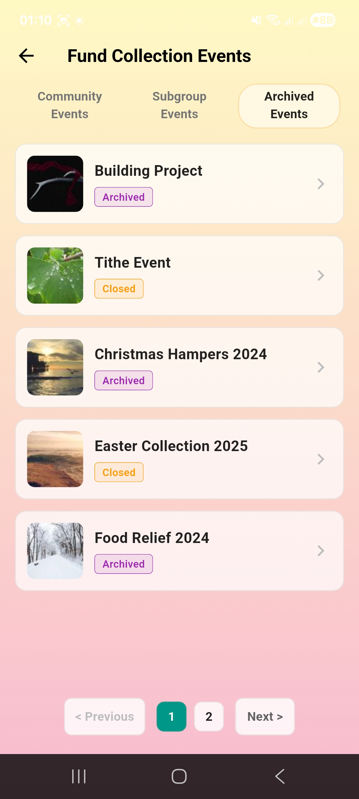
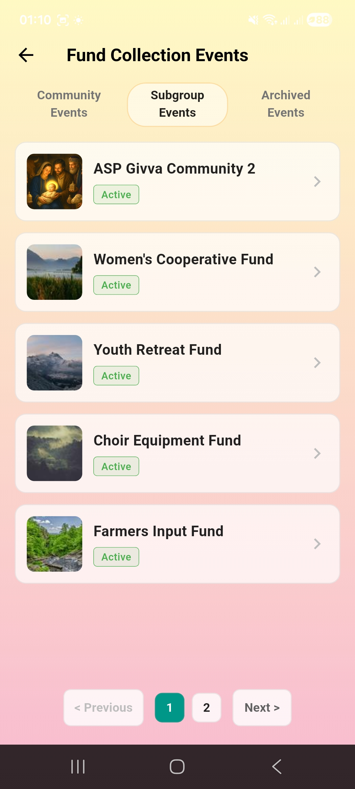
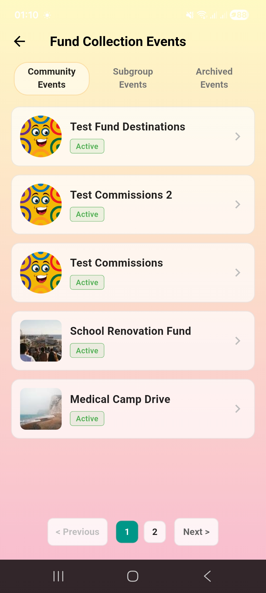

# GivvaEvents

A professional-grade Flutter application built as a takeaway assignment for Givva Wealthtech. This project demonstrates a clean implementation of a "Fund Collection Events" screen with paginated data and BLoC state management.

## 🚀 Features

- **Tabbed Navigation**: Separate tabs for Community, Subgroup, and Archived events.
- **Independent State Management**: Each tab maintains its own pagination and loading state independently.
- **Dynamic Status Logic**: 
  - `archivedAt != null` → **Archived** (Purple)
  - `closedAt != null` → **Closed** (Orange)
  - Otherwise → **Active** (Green)
- **Pagination**: Interactive "Previous", "Next", and numbered page buttons.
- **Modern UI**: Soft gradient background (Yellow-Green to Pink) and custom "pill" tab indicators.
- **Safe Area Integration**: Fully optimized for modern devices with bottom navigation bars.

## 🛠 Architecture

- **BLoC Pattern**: Used for predictable state management.
- **Clean Layers**:
  - `data/models`: Strongly typed data objects.
  - `data/mock`: Simulated API data.
  - `data/repositories`: Simulated data fetching with network latency.
  - `logic/bloc`: Business logic for event handling and state transitions.
  - `presentation`: Reusable widgets and screen layouts.

## 📦 Getting Started

### Prerequisites
- Flutter SDK (Channel stable)
- Android SDK / Xcode (for mobile development)

### Installation

1. **Clone the repository** (if applicable):
   ```bash
   git clone <repository-url>
   cd givva_events
   ```

2. **Get dependencies**:
   ```bash
   flutter pub get
   ```

3. **Run the application**:
   ```bash
   flutter run
   ```

## 📄 Mock Data
The app uses local mock data to simulate a real-world API response, including pagination metadata and an 800ms simulated network delay.

## Screenshots




